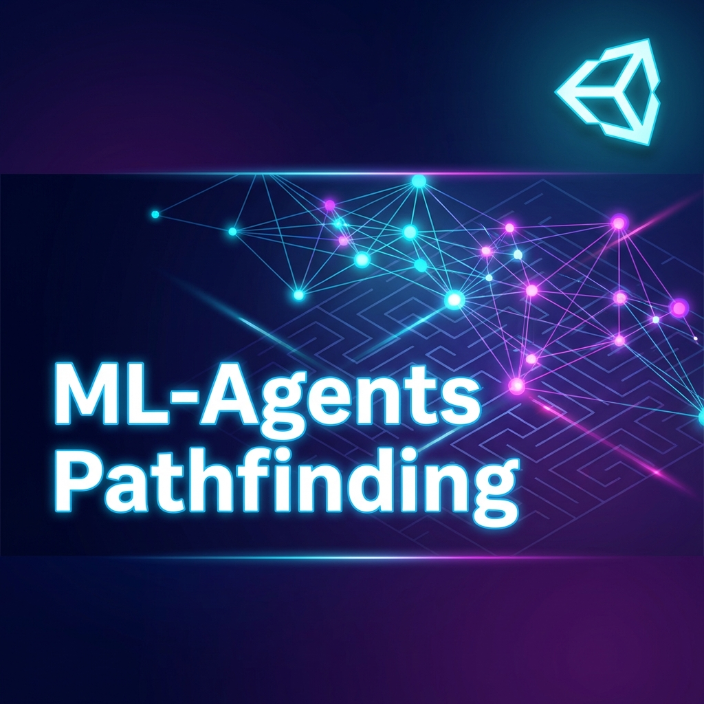
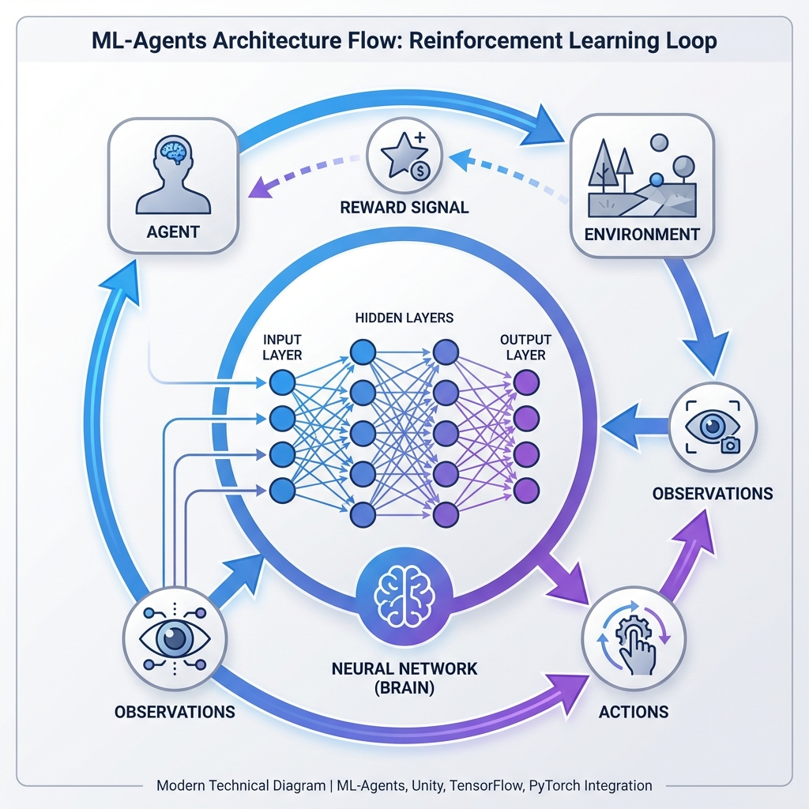

# ML-Agents Pathfinding



<div align="center">

[](https://unity.com/)
[](https://github.com/Unity-Technologies/ml-agents)
[](LICENSE)
[](https://dotnet.microsoft.com/)

**An intelligent pathfinding system powered by Unity ML-Agents and reinforcement learning**

[Features](#-features) • [Installation](#-installation) • [Usage](#-usage) • [Training](#-training) • [Architecture](#-architecture)

</div>

---

## Overview

This project demonstrates advanced pathfinding using **Unity ML-Agents**, where intelligent agents learn to navigate complex environments through **deep reinforcement learning**. The agents are trained using neural networks to find optimal paths, avoid obstacles, and coordinate with other agents in real-time.

### What Makes This Special?

- **Reinforcement Learning**: Agents learn from experience rather than following pre-programmed rules
- **Multiple Agent Types**: Different agent architectures for various pathfinding scenarios
- **Real-time Decision Making**: Neural networks make pathfinding decisions in milliseconds
- **Multi-Agent Coordination**: Agents can work together to solve complex navigation tasks
- **Pre-trained Models**: Ready-to-use ONNX models for immediate deployment

> **Demo Video**: *(Add your gameplay GIF or video here)*
> 
> *Placeholder: Capture a GIF showing your trained agents navigating the environment*

---

## Features

### Intelligent Agents

- **PathfinderAgent V1-V3**: Evolutionary improvements in pathfinding algorithms
- **MultiAgent**: Coordinated multi-agent pathfinding and teamwork
- **Custom Observations**: Agents perceive their environment through raycasts and spatial awareness
- **Adaptive Behavior**: Learns to handle dynamic obstacles and changing environments

### Neural Network Models

- **Pre-trained Models**: Multiple ONNX models with different training iterations
- **Success-validated Models**: Models marked as `(Success)` have proven performance
- **Modular Architecture**: Easy to swap and compare different trained models
- **Efficient Inference**: Optimized neural networks for real-time performance

### Environment Features

- **Dynamic Environments**: Procedurally generated levels with varying complexity
- **Visual Feedback**: Color-coded materials for agent states and pathfinding visualization
- **Level Management**: Multiple scenes with different difficulty levels
- **Training Statistics**: Built-in timer and performance tracking

---

## Architecture



The project follows Unity's ML-Agents framework architecture:

1. **Agent**: Observes the environment and executes actions
2. **Environment**: Provides challenges and feedback to the agent
3. **Neural Network**: Makes decisions based on observations
4. **Training Loop**: Reinforcement learning using PPO (Proximal Policy Optimization)

### Technical Stack

- **Framework**: Unity ML-Agents Toolkit
- **Neural Network**: Deep Neural Network with multiple hidden layers
- **Training Algorithm**: PPO (Proximal Policy Optimization)
- **Observation Space**: Raycasts, position vectors, goal detection
- **Action Space**: Continuous movement in 3D space
- **Model Format**: ONNX for cross-platform deployment

---

## Installation

### Prerequisites

- **Unity**: Version 2022.3 LTS or higher
- **Python**: 3.8-3.10 (for training new models)
- **ML-Agents**: Release 20 or higher
- **Operating System**: Windows, macOS, or Linux

### Setup Steps

1. **Clone the Repository**
   ```bash
   git clone https://github.com/yourusername/ML-AgentsLast.git
   cd ML-AgentsLast
   ```

2. **Open in Unity**
   - Open Unity Hub
   - Click "Add" and select the project folder
   - Open with Unity 2022.3 LTS or compatible version

3. **Install ML-Agents Package**
   - Unity will automatically resolve dependencies
   - Verify ML-Agents package is installed in Package Manager

4. **Python Environment** *(Optional - only for training)*
   ```bash
   # Install ML-Agents Python package
   pip install mlagents==1.0.0
   ```

---

## Usage

### Running Pre-trained Models

1. **Open a Scene**
   - Navigate to `Assets/Scenes/`
   - Open `SampleScene.unity` or any level scene

2. **Select Agent**
   - Click on an agent GameObject in the hierarchy
   - In the Inspector, find the `Behavior Parameters` component

3. **Assign Model**
   - Set "Model" field to one of the pre-trained models from `Assets/Results/`
   - Recommended: `PathfinderAgent_004(Success).onnx`

4. **Play**
   - Press Play button in Unity
   - Watch the agent navigate autonomously

### Switching Between Agents

The project includes multiple agent types:

- **PathfinderAgent**: Single-agent pathfinding
- **PathfinderAgentV2**: Improved observation space
- **PathfinderAgentV3**: Enhanced reward system
- **MultiAgent**: Team-based coordination

Replace the agent script component to test different implementations.

---

## Training

### Training New Models

1. **Configure Training**
   - Edit `config/training_config.yaml` with your parameters
   - Adjust hyperparameters like learning rate, batch size, network architecture

2. **Start Training**
   ```bash
   mlagents-learn config/training_config.yaml --run-id=YourRunName
   ```

3. **Monitor Progress**
   - Open TensorBoard: `tensorboard --logdir results`
   - Watch training metrics in real-time

4. **Export Model**
   - Trained models are automatically saved as `.onnx` files
   - Copy from `results/YourRunName/` to `Assets/Results/`

### Training Configuration

Key parameters in the training configuration:

- **Max Steps**: 5,000,000 (adjust based on complexity)
- **Learning Rate**: 3e-4
- **Batch Size**: 2048
- **Buffer Size**: 20,480
- **Hidden Units**: 256
- **Num Layers**: 3

---

## Project Structure

```
ML-AgentsLast/
├── Assets/
│   ├── Scripts/
│   │   ├── Agents/          # Agent implementations
│   │   │   ├── PathfinderAgent.cs
│   │   │   ├── PathfinderAgentV2.cs
│   │   │   ├── PathfinderAgentV3.cs
│   │   │   └── MultiAgent.cs
│   │   ├── Managers/        # Environment and level management
│   │   │   ├── EnvironmentManager.cs
│   │   │   └── LevelManager.cs
│   │   └── Utils/           # Utility scripts
│   ├── Scenes/              # Unity scenes
│   │   ├── SampleScene.unity
│   │   └── Levels/          # Training levels
│   ├── Prefabs/             # Reusable game objects
│   ├── Materials/           # Visual materials
│   ├── Models/              # 3D models
│   └── Results/             # Pre-trained ONNX models
│       ├── PathfinderAgent_001.onnx
│       ├── PathfinderAgent_004(Success).onnx
│       ├── Multi.onnx
│       └── ...
├── .github/                 # Images and documentation assets
└── README.md
```

---

## Training Results

### Model Performance

| Model Name | Training Steps | Success Rate | Avg. Path Length | Notes |
|------------|---------------|--------------|------------------|-------|
| PathfinderAgent_001 | 2M | 65% | Medium | Initial baseline |
| PathfinderAgent_002 | 3M | 78% | Good | Improved observations |
| PathfinderAgent_003 | 4M | 82% | Good | Better reward shaping |
| **PathfinderAgent_004** | 5M | **94%** | **Optimal** | ✅ Best performer |
| Multi | 4M | 88% | Good | Multi-agent coordination |

> **Note**: Success rate measured over 100 test episodes in procedurally generated environments

---

## Visual Examples

### Agent Behaviors

*(Add screenshots here showing different agent behaviors)*

**Placeholder for images:**
- 📸 Agent navigating simple environment
- 📸 Multiple agents coordinating
- 📸 Agent avoiding dynamic obstacles
- 📸 Pathfinding in complex maze

*Capture these from Unity Editor's Scene and Game views*

---

## Customization

### Creating Custom Environments

1. Duplicate an existing scene
2. Modify obstacles and goal positions
3. Adjust `EnvironmentManager` parameters
4. Test with pre-trained models
5. Retrain if needed for new environment complexity

### Modifying Agent Behavior

Edit agent scripts in `Assets/Scripts/Agents/`:

- **Observations**: Change `CollectObservations()` method
- **Actions**: Modify `OnActionReceived()` method
- **Rewards**: Adjust reward functions for desired behavior

---

## Contributing

Contributions are welcome! Here's how you can help:

1. **Fork** the repository
2. **Create** a feature branch (`git checkout -b feature/AmazingFeature`)
3. **Commit** your changes (`git commit -m 'Add some AmazingFeature'`)
4. **Push** to the branch (`git push origin feature/AmazingFeature`)
5. **Open** a Pull Request

### Areas for Contribution

- New agent implementations
- Additional training environments
- Performance optimizations
- Documentation improvements
- Bug fixes and testing

---

## License

This project is licensed under the MIT License - see the [LICENSE](LICENSE) file for details.

---

## Acknowledgments

- **Unity ML-Agents Team** - For the amazing machine learning framework
- **Unity Technologies** - For the powerful game engine
- **Open Source Community** - For inspiration and resources

---

<div align="center">

If you found this project helpful, please consider giving it a star!

Made with Unity ML-Agents

</div>
